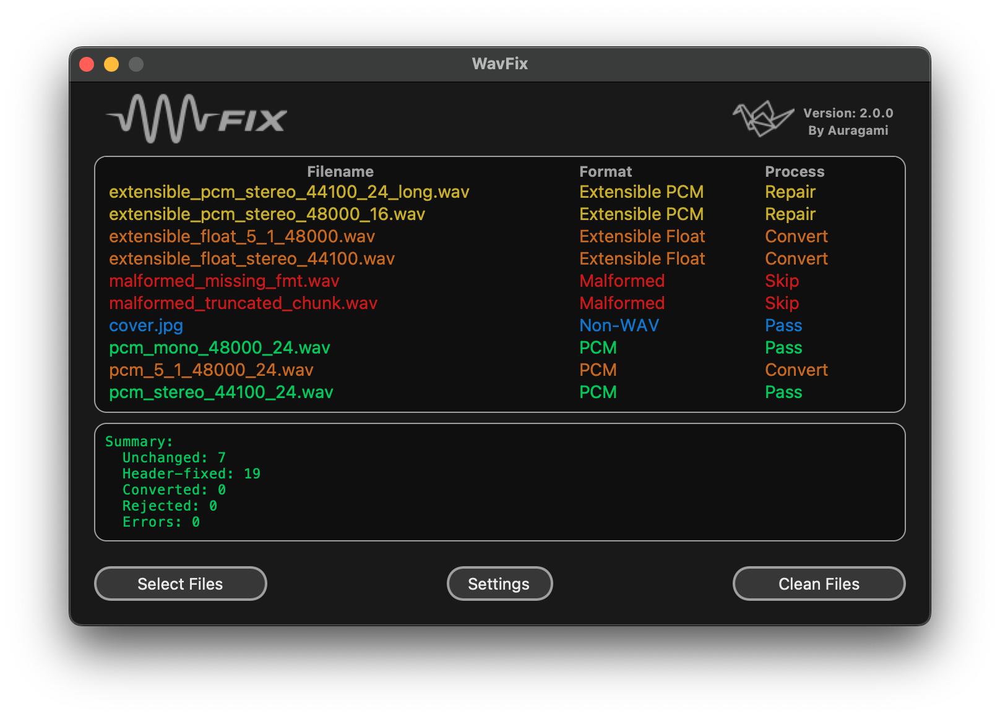

# WavFix



WavFix 2.0.0 makes WAV files Pioneer-compatible using the safest valid action per file:

- `PASS_THROUGH`: already compatible PCM, copied unchanged
- `HEADER_FIX`: extensible PCM normalized to canonical PCM header (audio data unchanged)
- `CONVERT`: true audio conversion to PCM when required (float/incompatible format)
- `REJECT`: unsupported or unsafe-to-process inputs

Release: `2.0.0` (`2026-06-24`).
Latest published release: `1.1.0` (`2023-04-26`).

Published binaries:
<https://github.com/Dreamwalkertunes/WavFix/releases>

## UI Notes (2.0.0)

- Tree Process labels/colors:
  - `Pass`: green
  - `Repair`: yellow
  - `Convert`: orange
  - `Skip/Error`: red
  - non-WAV pass-through/neutral: blue
- Output log colors:
  - action lines (`Unchanged copy`, `Header fixed`, `Converted`): green
  - warnings/rejects/errors: red
  - neutral/info lines (including non-WAV pass-through): blue
  - summary lines: green/orange/red based on overall result severity
- Audio conversion uses WavFix's built-in `soundfile + soxr` backend by default.
- FFmpeg is a free optional conversion backend. If users select FFmpeg in Settings and
  WavFix cannot find it, the app shows an official download link and source controls.
- Update checks can be enabled in Settings. WavFix checks GitHub Releases periodically,
  notifies when a newer version is available, and lets users download, defer, or skip
  that version.
- 2.0 branding update includes new header logos (light/dark variants) and packaged app icons.

## Intelligent Processor (2.0.0)

WavFix no longer performs blind fixed-byte header edits. The 2.0 processor uses a format-safe pipeline:

1. Parse RIFF/WAVE structure by chunk (`fmt`, `data`, padding-aware).
2. Classify each WAV (`PCM`, `float`, `extensible PCM`, `extensible float`, unsupported/malformed).
3. Decide action (`PASS_THROUGH`, `HEADER_FIX`, `CONVERT`, `REJECT`) from parsed metadata and selected profile/policies.
4. Execute safely:
   - `PASS_THROUGH`: unchanged copy
   - `HEADER_FIX`: canonical PCM header normalization only when parse-verified safe
   - `CONVERT`: real audio conversion via built-in `soundfile + soxr` backend by default
     (perceptual downmix, single-stage TPDF-dithered quantization, stream/block processing)
   - `REJECT`: skip with explicit reason when unsafe/unsupported
5. Re-parse outputs for post-write validation.

### Safety Rules

- Never relabel float audio as PCM without conversion.
- Never assume `FF FE` always means safe header rewrite.
- Never rely on absolute WAV byte offsets for format detection/modification.
- Reject/skip when classification is uncertain instead of guessing.

### Multithreaded Processing

- Core processing is multithreaded for faster batches.
- Performance mode controls concurrency to balance throughput vs. system load.
- Resampler quality is tuned per mode:
  - `Conservative`: `HQ`
  - `Balanced`: `VHQ`
  - `Fast`: `HQ`
- Conversion runs in streaming blocks to keep memory bounded on large files.
- Conversion actions still require explicit CLI consent (`--allow-conversion`).

## Canonical Build Path

1. Install runtime/build dependencies:

   ```bash
   make install
   ```

   This installs runtime/build requirements from `requirements.txt` (including `pyinstaller`).

2. Build the app (PyInstaller canonical path):

   ```bash
   make build
   ```

3. Find output artifacts in `dist/`.

Notes:

- `make build` uses `src/WavFix.spec`.
- `build/` intermediates are cleaned by default after build.
- Release artifacts should be built with Python 3.12; source compatibility remains `>=3.11`.

## Developer Setup (for `make check`)

Install development tooling before running quality gates:

```bash
make install-dev
```

`make install-dev` installs the optional `dev` extras from `pyproject.toml`
(`pytest`, `ruff`, `pyright`).

## Fresh Environment Validation

Use this sequence to verify dependency setup from a clean environment:

1. `make install` (runtime/build dependencies)
2. `make build` (or your target build command)
3. `make check` (expected to fail if dev tools are not installed yet)
4. `make install-dev`
5. `make check` (expected to pass)

## Run From Source

- GUI:

  ```bash
  make run-gui
  ```

- CLI:

  ```bash
  make run-cli ARGS="./tracks --batch --output ./out --overwrite no"
  ```

- Direct module entrypoint:

  ```bash
  PYTHONPATH=src python -m wavfix ./tracks --batch --output ./out --overwrite no
  ```

## CLI Safety Flags

Use these when you need explicit processing behavior:

- `--allow-conversion`: required to permit audio-data conversion actions
- `--profile {preserve_supported_rate,universal_pioneer_safe}`
- `--multichannel-policy {reject,downmix}`
- `--metadata-policy {best_effort,strict_preserve}`
- `--sample-rate-policy {convert_nearest,reject_unsupported}`
- `--bit-depth-policy {convert,reject_unsupported}`

Example:

```bash
make run-cli ARGS="./tracks --batch --output ./out --overwrite no --allow-conversion --profile preserve_supported_rate"
```

## Development Commands

- `make help` to list targets
- `make install-dev` before running quality gates
- `make check` to run format-check + lint + typecheck + tests
- `make test` to run tests only

## Advanced Build Options (By Use Case)

1. Keep PyInstaller intermediates for packaging/debug inspection:

   ```bash
   make build KEEP_BUILD=1
   ```

2. Build with active environment stdlib resolution:

   ```bash
   make build USE_VENV=1
   ```

3. Use cx_Freeze instead of PyInstaller:

   ```bash
   make build-cxfreeze
   ```

4. Use legacy scripts for historical parity:

   - macOS: `bash build_scripts/build_mac.sh`
   - Windows: `build_scripts\build_windows.bat`

## Project Structure

- `src/WavFix.py`: compatibility launcher for legacy entry paths
- `src/wavfix/ui/app_shell.py`: GUI runtime entry + shell orchestration
- `src/wavfix/core`: parsing, classification, decisions, planning, execution
- `src/wavfix/ui`: Tkinter UI/controllers
- `src/wavfix/config`: persisted UI settings
- `src/wavfix/cli.py`: CLI entrypoint
- `tests/`: parser/decision/core/config/cli tests

## Documentation

- Changelog: [CHANGELOG.md](CHANGELOG.md)
- Contribution guide: [CONTRIBUTING.md](CONTRIBUTING.md)
- User guide PDF: [docs/WavFix_User_Guide.pdf](docs/WavFix_User_Guide.pdf)

## License

WavFix is released under GNU GPL v3.0. See [LICENSE](LICENSE).
